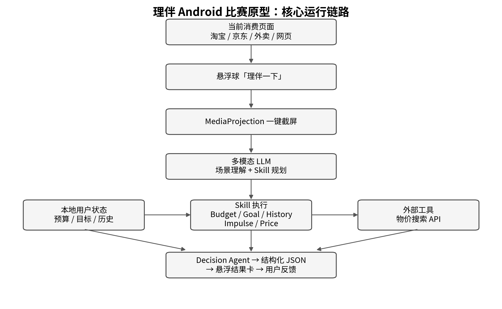

# 理伴 Android 比赛版实现计划

> 悬浮窗 · 一键截屏 · 多模态 LLM · Dynamic Skill Orchestration
>
> Implementation Plan V1.1

**目标：** 在短周期内完成可稳定演示的 Android 消费决策 Agent 原型。

**版本：** V1.1

# 1. 项目目标

构建一个 Android 消费决策助手。用户在当前消费页面点击悬浮球“理伴一下”，应用截取当前屏幕，由多模态模型识别商品、价格和促销信息，动态选择消费决策 Skill，调用本地用户状态和外部物价搜索工具，最后以悬浮卡片返回结构化建议，并记录用户反馈。

1.  实现可拖动悬浮球，作为消费场景的一键入口。

2.  使用 MediaProjection 获取用户主动触发时的当前屏幕帧。

3.  使用多模态 LLM 完成场景理解、商品与价格提取、促销信号识别和 Skill 规划。

4.  实现 Budget、Goal、History、Impulse、Price 五个 Skill。

5.  使用本地预算、储蓄目标和消费历史提供个性化上下文。

6.  使用物价搜索接口完成真实 Tool Calling。

7.  使用第二次 LLM 调用综合 SceneContext 与 SkillResults，生成 DecisionResult JSON。

8.  通过“还是买 / 等等 / 放弃”记录反馈并更新本地历史。

# 2. 核心运行流程



图 1 理伴 Android 核心运行链路

## 2.1 单次消费决策流程

```text
用户浏览商品或准备消费
↓
点击悬浮球「理伴一下」
↓
悬浮球隐藏，MediaProjection 获取当前屏幕帧
↓
Call 1：多模态 LLM 输出 SceneContext + RequiredSkills
↓
Android 执行本地 Skill 与物价搜索 Tool
↓
Call 2：Decision Agent 综合 SceneContext + SkillResults
↓
返回 DecisionResult JSON
↓
悬浮结果卡展示风险、原因与建议
↓
用户选择：还是买 / 等等 / 放弃
↓
写入 DecisionHistory 并更新本地状态
```

## 2.2 首次启动流程

```text
欢迎页
↓
设置月预算
↓
设置储蓄目标
↓
申请悬浮窗权限
↓
开启识屏模式并申请 MediaProjection 授权
↓
显示悬浮球
↓
进入可演示状态
```

# 3. Android 模块设计

## 3.1 Floating Interaction

- Foreground Service 维持悬浮球服务。

- WindowManager + TYPE_APPLICATION_OVERLAY 绘制悬浮球和结果卡。

- 悬浮球支持拖动、点击触发、分析中状态与结果展开。

- 截屏前临时隐藏悬浮球，获取图像后恢复显示。

- 结果卡包含风险等级、关键因素、建议和三个反馈按钮。

## 3.2 Screen Capture

- MediaProjection 获取屏幕捕获授权。

- VirtualDisplay 将屏幕内容输出到 ImageReader。

- ScreenCaptureManager 在用户点击悬浮球时读取最新帧。

- 图像转换为 JPEG/PNG 后发送至多模态 LLM API。

- 截屏结果为空时切换至手动输入商品名称与价格。

## 3.3 Agent Manager

| **阶段**                      | **输入**                    | **输出**                      | **职责**                             |
|-------------------------------|-----------------------------|-------------------------------|--------------------------------------|
| Call 1：Perception & Planning | Screenshot                  | SceneContext + RequiredSkills | 识别页面并规划需要执行的 Skill       |
| Skill Execution               | SceneContext + Local State  | SkillResults                  | 执行预算、目标、历史、冲动与价格能力 |
| Call 2：Decision              | SceneContext + SkillResults | DecisionResult                | 形成最终风险、理由和建议             |

## 3.4 Local Data

| **数据实体**    | **关键字段**                                 | **用途**           |
|-----------------|----------------------------------------------|--------------------|
| UserProfile     | monthlyBudget, currentSpent, categoryBudget  | 预算判断           |
| SavingGoal      | targetAmount, currentAmount, deadline        | 长期目标影响       |
| Transaction     | name, category, amount, timestamp            | 同类消费频率与历史 |
| DecisionHistory | scene, recommendation, userAction, timestamp | 反馈记录与状态更新 |

# 4. Skill 体系

| **Skill**       | **核心任务**                       | **数据来源** | **输出**                             |
|-----------------|------------------------------------|--------------|--------------------------------------|
| BudgetCheck     | 计算本次消费对剩余预算的占用程度   | 本地预算     | budget_ratio, risk                   |
| GoalImpact      | 估算本次消费对储蓄目标的影响       | 本地目标     | goal_pressure, delay_estimate        |
| PurchaseHistory | 统计近期同类消费次数与频率         | 本地历史     | similar_count, frequency_risk        |
| ImpulseCheck    | 识别限时、稀缺、秒杀、倒计时等信号 | SceneContext | impulse_risk, signals                |
| PriceCompare    | 查询市场参考价并比较当前价格       | 物价搜索 API | reference_range, premium_or_discount |

## 4.1 Skill Router

Call 1 返回 required_skills。Android 根据该字段调用对应 Skill。V1 使用以下基础路由规则作为回退逻辑：

低金额日常消费 → BudgetCheck + PurchaseHistory
明显促销场景 → BudgetCheck + PurchaseHistory + ImpulseCheck
大额消费 → BudgetCheck + GoalImpact + PurchaseHistory + PriceCompare
数码/耐用品 → BudgetCheck + GoalImpact + PurchaseHistory + ImpulseCheck + PriceCompare

## 4.2 Skill 执行顺序

```text
SceneContext
↓
读取 UserProfile / SavingGoal / Transaction
↓
执行 BudgetCheck / GoalImpact / PurchaseHistory
↓
读取 SceneContext.signals 执行 ImpulseCheck
↓
RequiredSkills 包含 PriceCompare 时调用物价搜索 API
↓
汇总为 SkillResults
```

# 5. 核心数据协议

## 5.1 SceneContext

```json
{
  "scene_type": "ecommerce_product",
  "product": {
    "name": "Sony WH-1000XM6",
    "category": "electronics"
  },
  "price": {
    "current": 2899,
    "original": 3199,
    "currency": "CNY"
  },
  "signals": {
    "discount": true,
    "limited_time": true,
    "scarcity": false
  },
  "required_skills": [
    "budget_check",
    "goal_impact",
    "history_check",
    "impulse_check",
    "price_compare"
  ],
  "confidence": 0.93
}
```

## 5.2 SkillResults

```json
{
  "budget": {"budget_ratio": 0.84, "risk": "HIGH"},
  "goal": {"pressure": "HIGH", "delay_days": 12},
  "history": {"similar_count_30d": 2, "risk": "MEDIUM"},
  "impulse": {"risk": 0.76, "signals": ["limited_time_discount"]},
  "price": {"reference_low": 2499, "reference_high": 2699, "page_price": 2899}
}
```

## 5.3 DecisionResult

```json
{
  "risk_score": 0.78,
  "risk_level": "HIGH",
  "recommendation": "DELAY",
  "delay_hours": 24,
  "factors": [
    "budget_pressure",
    "saving_goal_pressure",
    "price_not_at_low_point"
  ],
  "display": {
    "title": "建议再等等",
    "summary": "这笔消费会明显压缩本月剩余预算，且当前价格并非近期低位。",
    "key_points": [
      "将占用本月剩余非必要预算的 84%",
      "近 30 天已有 2 次同类消费",
      "当前价格高于近期参考区间"
    ]
  }
}
```

## 5.4 JSON 解析约束

- Call 1 与 Call 2 均要求结构化 JSON 响应。

- Android 使用固定数据类解析，缺失字段采用 nullable/default 值。

- 解析失败时自动重试一次；第二次仍失败则显示简化错误提示。

- SceneContext.confidence 低于阈值时允许用户快速修正商品名称或价格。

# 6. 页面与交互

| **页面** | **主要内容**                                   | **优先级** |
|----------|------------------------------------------------|------------|
| 首页     | 本月预算、已消费、剩余预算、当前目标、最近决策 | P0         |
| 预算     | 总预算与分类预算设置                           | P0         |
| 目标     | 目标金额、当前金额、截止时间                   | P0         |
| 历史     | 消费记录与 Agent 决策记录                      | P1         |

## 6.1 悬浮球状态

Idle：显示小型悬浮球
Capturing：短暂隐藏悬浮球并截屏
Analyzing：显示“正在分析...”状态
Result：展开结果卡
Error：显示可重试或手动输入入口

## 6.2 悬浮结果卡

```text
┌────────────────────────────┐
│ 🟠 建议再等等 │
│ │
│ Sony WH-1000XM6 · ¥2,899 │
│ │
│ 预算压力 高 │
│ 目标影响 中高 │
│ 当前价格 一般 │
│ 冲动风险 中 │
│ │
│ 这笔消费将占用你本月剩余 │
│ 非必要预算的 84%，且当前 │
│ 价格并非近期低位。 │
│ │
│ \[还是买\] \[等等\] \[放弃\] │
└────────────────────────────┘
```

## 6.3 反馈处理

- 还是买：写入 PURCHASE，并可同步增加 currentSpent。

- 等等：写入 DELAY，并保存 delay_hours。

- 放弃：写入 CANCEL。

- 每次反馈写入 DecisionHistory，首页和历史页可直接展示。

# 7. 技术栈与代码结构

| **类别**  | **实现方案**                                                  |
|-----------|---------------------------------------------------------------|
| 语言 / UI | Kotlin + Jetpack Compose                                      |
| 悬浮窗    | Foreground Service + WindowManager + TYPE_APPLICATION_OVERLAY |
| 截屏      | MediaProjection + VirtualDisplay + ImageReader                |
| 网络      | OkHttp / Retrofit                                             |
| 本地数据  | Room                                                          |
| AI        | 支持图片输入与结构化输出的多模态 LLM API                      |
| 外部工具  | 物价搜索 / 通用搜索 API                                       |
| 配置      | local.properties → BuildConfig 注入 API Key                   |

## 7.1 建议代码目录

```text
com.liban.android
├── MainActivity.kt
├── floating/
│ ├── FloatingService.kt
│ └── FloatingResultView.kt
├── capture/
│ ├── CaptureService.kt
│ └── ScreenCaptureManager.kt
├── agent/
│ ├── AgentManager.kt
│ ├── SkillRouter.kt
│ ├── AgentModels.kt
│ └── JsonParser.kt
├── skill/
│ ├── BudgetSkill.kt
│ ├── GoalSkill.kt
│ ├── HistorySkill.kt
│ ├── ImpulseSkill.kt
│ └── PriceSkill.kt
├── api/
│ ├── LlmApi.kt
│ └── PriceApi.kt
├── data/
│ ├── UserProfile.kt
│ ├── SavingGoal.kt
│ ├── Transaction.kt
│ ├── DecisionHistory.kt
│ └── AppDatabase.kt
└── ui/
├── HomeScreen.kt
├── BudgetScreen.kt
├── GoalScreen.kt
└── HistoryScreen.kt
```

# 8. 21 天开发计划

| **阶段**         | **时间**  | **任务**                                  | **阶段验收**                                |
|------------------|-----------|-------------------------------------------|---------------------------------------------|
| Phase 1 核心链路 | Day 1–3   | 悬浮球 + MediaProjection + 截图           | 在淘宝/网页中点击悬浮球可获得当前截图       |
|                  | Day 4–5   | 接入多模态 LLM，输出 SceneContext         | 截图可稳定解析出商品、价格和 RequiredSkills |
| Phase 2 Agent    | Day 6–7   | SkillRouter + Budget/Goal/History/Impulse | 按场景调用对应 Skill                        |
|                  | Day 8–9   | Room 本地用户状态                         | 预算、目标、历史可读写                      |
|                  | Day 10    | Price Search Tool                         | 可获取参考价格并结构化                      |
|                  | Day 11    | Decision Agent（Call 2）                  | 得到稳定 DecisionResult JSON                |
| Phase 3 产品体验 | Day 12–13 | 悬浮结果卡                                | 分析结果可在当前 App 上层展示               |
|                  | Day 14–15 | 首页 / 预算 / 目标 / 历史                 | 主 App 页面可完整操作                       |
|                  | Day 16–17 | 购买/等待/放弃反馈                        | 反馈写入 DecisionHistory                    |
| Phase 4 稳定性   | Day 18–19 | 异常处理与 JSON 重试                      | 截图、网络、解析失败均有可用降级            |
|                  | Day 20–21 | 固定 Demo 调优与真机测试                  | 3 个固定 Demo 可连续复现                    |

## 8.1 P0 开发顺序

1. FloatingService
2. ScreenCaptureManager
3. LlmApi（Call 1）
4. SceneContext 数据类与解析
5. Room 数据库
6. Budget / Goal / History / Impulse Skill
7. PriceApi + PriceSkill
8. LlmApi（Call 2）
9. DecisionResult 解析
10. FloatingResultView
11. Feedback + DecisionHistory
12. 首页 / 预算 / 目标 / 历史

# 9. 固定演示场景

## 9.1 Demo A：明显冲动消费

- 页面：¥899，出现“限时优惠”“仅剩 2 件”。

- 用户状态：娱乐预算剩余 ¥600。

- Skill：BudgetCheck + PurchaseHistory + ImpulseCheck。

- 预期结果：HIGH，recommendation = DELAY，delay_hours = 24。

## 9.2 Demo B：价格判断

- 页面：商品价格 ¥2899。

- PriceCompare：近期参考价 ¥2499–2699。

- Skill：PriceCompare + BudgetCheck。

- 预期结果：提示当前价格高于参考区间，并给出等待建议。

## 9.3 Demo C：长期目标影响

- 页面：¥7999 笔记本。

- 用户状态：存在尚未完成的储蓄目标。

- Skill：BudgetCheck + GoalImpact + PurchaseHistory + PriceCompare。

- 预期结果：输出目标压力与预算压力，并给出延迟决策建议。

# 10. 风险与降级处理

| **异常**                 | **检测方式**                    | **处理**                                         |
|--------------------------|---------------------------------|--------------------------------------------------|
| MediaProjection 会话中断 | capture 返回空帧 / exception    | 提示重新开启识屏模式                             |
| 受保护页面               | 截图黑屏或有效像素异常          | 切换手动输入商品名称与价格                       |
| LLM 商品/价格识别不准    | confidence 低或用户反馈识别有误 | 提供快速修正并重新执行 Agent                     |
| JSON 解析失败            | 反序列化异常                    | 自动重试一次；仍失败则提示重新分析               |
| 物价搜索无结果           | 空结果 / timeout                | PriceSkill 返回 unavailable，其余 Skill 继续执行 |
| 网络超时                 | HTTP timeout                    | 8–12 秒超时并提供重试                            |
| 结果卡显示异常           | WindowManager exception         | 回到 App 内结果页展示                            |

# 11. MVP 验收标准

## 11.1 P0 功能验收

- 悬浮球可显示、拖动、点击并进入分析状态。

- MediaProjection 可在目标页面获取有效截图。

- Call 1 可输出结构化 SceneContext 和 RequiredSkills。

- BudgetCheck、GoalImpact、PurchaseHistory、ImpulseCheck、PriceCompare 均可执行。

- PriceCompare 至少完成一次真实外部搜索调用。

- Call 2 可输出结构化 DecisionResult。

- 悬浮结果卡可显示 risk_level、recommendation、summary 与 key_points。

- “还是买 / 等等 / 放弃”可写入 DecisionHistory。

- 首页可读取并展示预算、目标和最近决策。

- 3 个固定 Demo 在真机上可连续复现。

## 11.2 完成定义

当“悬浮球 → 截图 → Call 1 → Skill/Tool → Call 2 → JSON → 悬浮结果卡 → 用户反馈”整条链路在真机上连续运行稳定，并完成三个固定演示场景，即视为 V1.1 完成。
